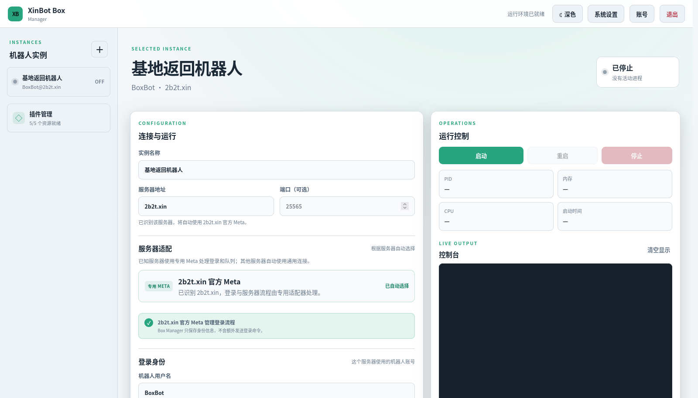

# XinBot Box Manager

面向无头 Linux 主机的轻量 XinBot 网页管理端。通过一个浏览器入口管理多个相互隔离的
XinBot 实例，适合 BTTB、消息响应等常驻场景。

> 项目目前处于 `0.1.x` 原型阶段，功能和接口仍可能调整。请勿把未启用 HTTPS 的管理端
> 直接暴露到公网。



## 主要功能

- **多实例管理**：创建、编辑、可恢复删除和运行多个隔离的 XinBot 实例；
- **运行控制**：启动、停止、重启、发送控制台命令，并实时查看日志、PID、CPU 和内存；
- **配置与插件**：管理 Core、Meta 和普通插件，自动处理插件依赖及已知服务器的专用 Meta；
- **BTTB 配置**：通过专用页面编辑玩家、珍珠按钮、返回点和游戏内管理员；
- **网页认证**：单管理员账号、登录限速、浅色/深色主题，以及 Linux 控制台密码恢复；
- **轻量部署**：Rust 单进程内嵌网页，`.deb` 同时安装 Core、XinMeta、BTTB、MovementSync
  和 systemd 服务，无需常驻 Node.js。

## 快速安装

从 [GitHub Releases](https://github.com/newPlayerAL/xinbot-box-manager/releases/latest)
下载与设备架构对应的软件包：

- [AMD64 / x86-64](https://github.com/newPlayerAL/xinbot-box-manager/releases/download/v0.1.0/xinbot-box-manager_0.1.0_amd64.deb)
- [ARM64 / AArch64](https://github.com/newPlayerAL/xinbot-box-manager/releases/download/v0.1.0/xinbot-box-manager_0.1.0_arm64.deb)

下载后执行：

```shell
sudo apt install ./xinbot-box-manager_0.1.0_amd64.deb
```

ARM64 设备将文件名中的 `amd64` 改为 `arm64`。安装完成后访问：

```text
http://设备IP:8080
```

首次打开会要求创建管理员账号。软件包会自动安装 Java 运行时、启用 systemd 服务，并准备
XinBot Core 和内置插件。

## 许可证

本项目采用 [GNU GPL v3.0 或更高版本](LICENSE)。随安装包分发的 XinBot Core、插件和 Java
仍分别遵循其自身许可证。
